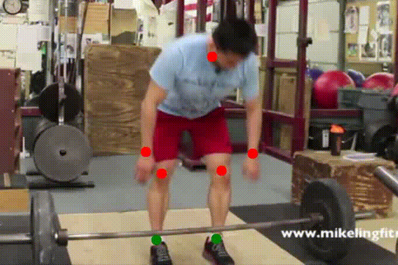

# Recognizing contact states from image

Zongmian Li, Jiri Sedlar, Justin Carpentier, Ivan Laptev, Nicolas Mansard and Josef Sivic

[Project page](https://www.di.ens.fr/willow/research/motionforcesfromvideo/)



Human joints recognized as in contact are shown in green, joints not in contact in red.


## Installation

### Required dependencies

- Python 2 (tested on version 2.7)
- [PyTorch](https://pytorch.org/) (tested on version 0.3.1)
- Openpose (we are using this [fork](https://github.com/zongmianli/Realtime_Multi-Person_Pose_Estimation))
- [CUDA](https://developer.nvidia.com/cuda-downloads) (tested on CUDA 10.1 with GeForce GTX TITAN X)

### Recommended tools

- [ffmpeg](https://ffmpeg.org/) (required for creating and annotating new data)
- [virtualenv](https://virtualenv.pypa.io/en/latest/) (for creating isolated Python environments)

### Install contact recognizer

1. Make a local copy of the project:
   ```terminal
   git clone https://github.com/zongmianli/contact-recognizer.git ~/contact-recognizer
   cd ~/contact-recognizer
   ```

2. Set up *virtualenv* for the project:
   ```terminal
   virtualenv venv_contact_rec -p python2.7
   source venv_contact_rec/bin/activate
   pip install -U pip
   pip install -r requirements.txt
   ```

3. Download and set up pre-trained models:
   ```terminal
   wget https://www.di.ens.fr/willow/research/motionforcesfromvideo/contact-recognizer/models.tar.gz
   tar -xf models.tar.gz
   ```
   This will create a top-level directory `models/` which contains five pre-trained CNNs for recognizing the contact states of a set of human joints of interest: *hands*, *knees*, *soles*, *toes* and *neck*.

### Demo

1. Download and set up the demo data by running:
   ```terminal
   source scripts/setup_demo_data.sh
   ```
   This will create a top-level directory `data/` in `~/contact-recognizer/` with two subfolders:
   - `data/full_images/`, which contains the demo video (in the form of image sequence) and the joint 2D positions obtained by applying [Openpose](https://github.com/zongmianli/Realtime_Multi-Person_Pose_Estimation) to the frame images;
   - `data/joint_images/`, which contains HDF5 data files of fixed-size image patches of human joints.
   The joint image patches, or simply *joint images*, are obtained by cropping around the five joints of interest given their estimated 2D positions in the images.
   
2. Run the demo.
   Update `repo_dir` in [scripts/run_demo.sh](https://github.com/zongmianli/contact-recognizer/blob/public/scripts/run_demo.sh) and run:
   ```terminal
   source scripts/run_demo.sh
   ```
   This script will feed the joint images to the pre-trained CNNs to obtain an estimate for the joint contact states.
   The predicted contact states are saved in `results/demo.pkl` together with a set of visualization images saved in `results/demo_vis/`.
   The visualization images are also shown in the teaser GIF of this page.


## Training

See [doc/train.md](https://github.com/zongmianli/contact-recognizer/blob/public/doc/train.md).


## Testing & visualization

See [doc/test.md](https://github.com/zongmianli/contact-recognizer/blob/public/doc/test.md).


## Citation

If you find the code useful, please consider citing:
```bibtex
@InProceedings{li2019motionforcesfromvideo,
  author={Zongmian Li and Jiri Sedlar and Justin Carpentier and Ivan Laptev and Nicolas Mansard and Josef Sivic},
  title={Estimating 3D Motion and Forces of Person-Object Interactions from Monocular Video},
  booktitle={Computer Vision and Pattern Recognition (CVPR)},
  year={2019}
}
```
